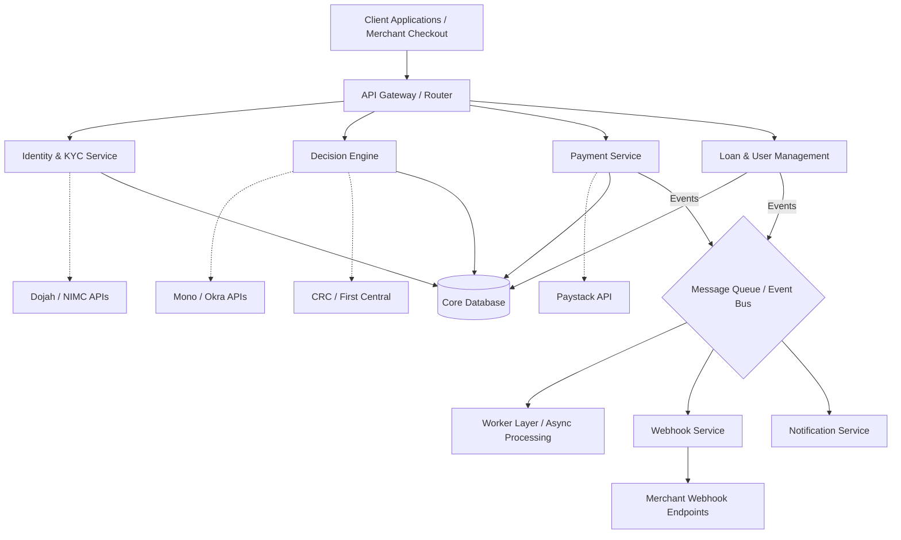

# CreditOS (Lendr) - Product Architecture

## 1. High-Level Architecture Design

The system will be built as a **Modular Monolith** in Phase 1, using an event-driven architecture to ensure scalability and reliability. This approach allows rapid iteration while setting the foundation for microservices if needed in Phase 2 or 3.

## 2. Core Components

1.  **API Gateway**: The single entry point for merchant checkouts and internal applications, routing traffic to the corresponding modules.
2.  **Identity & KYC Service**: Validates users against external databases (e.g., Dojah, NIMC) verifying BVN and NIN.
3.  **Decision Engine**: The core credit scoring system processing financial metrics and hard rejection filters in under 500ms.
4.  **Payment Service**: Handles inbound repayments and outbound loan disbursements via external payment processors (e.g., Paystack).
5.  **Loan & User Management**: The central ledger keeping track of account balances, active loans, and user risk tier.
6.  **Message Queue / Event Bus**: Facilitates asynchronous communication (e.g., RabbitMQ, Redis Streams) to offload time-consuming tasks from the main thread.
7.  **Webhook & Notification Workers**: Listens for state changes (like loan approval or payment failure) and sends callbacks to the merchant's API or notifications to the user.
