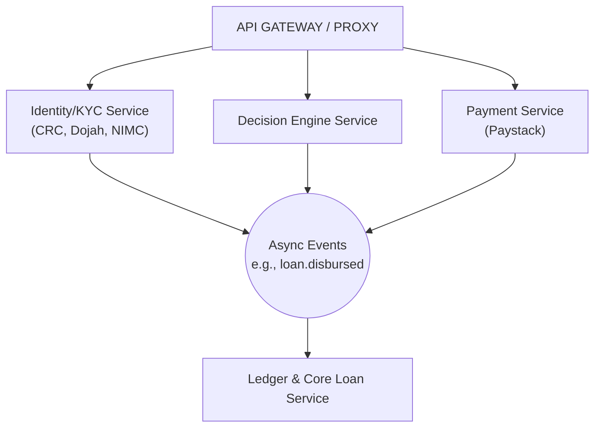

# CreditOS (Lendr) 🚀

CreditOS is a high-performance, event-driven **Embedded Credit Infrastructure** platform. Built on a modular monolith microservices architecture, it enables merchants to seamlessly integrate instant point-of-sale (POS) credit options directly into their checkout flows.

## 🏗 System Architecture



The backend is composed of four strictly typed Node.js microservices, orchestrated via an API Gateway and communicating asynchronously through a Redis Event Stream.

### Core Microservices:
1. **Identity & KYC Service**: Handles identity validation. Integrates AES-256 field-level encryption for sensitive PII (BVN/NIN) and executes Hard Rejection layers (e.g., mismatching DOB or reused device fingerprints).
2. **Decision Engine**: An in-memory, high-speed 100-point credit scoring engine that evaluates Capacity, Credit History, Behavioral signals, and Stability, returning Risk Tiers (A, B, C, D) in under 500ms.
3. **Payment Processing**: Manages disbursements and collections. Features a real integration interface with Paystack, including an interval-based `AutoDebitQueue` worker with a strict 3x retry policy for tokenized card debits, and HMAC-SHA256 Signed Webhook dispatchers.
4. **Core Ledger & Loan**: The accounting heart of the system. Utilizes Prisma `$transaction` blocks and Prisma Client Extensions middleware to enforce strict immutability on Ledger database records.

### Infrastructure & Frontends:
- **API Gateway**: An Express-based reverse proxy (`http-proxy-middleware`) that intelligently routes frontend requests to the appropriate internal services.
- **Developer Portal**: A sleek, modern React application built with Vite and Redocly, serving as the interactive OpenAPI documentation and portfolio showcase.
- **Message Broker**: Redis Streams handles asynchronous domain events (`loan.created`, `loan.disbursed`) via Consumer Groups.
- **Databases**: PostgreSQL clusters managed by Prisma ORM.
- **Orchestration**: Fully containerized using a multi-stage Docker configuration and Docker Compose for one-click cluster spin-up.

## 🛠 Tech Stack
- **Language**: TypeScript / Node.js
- **API & Routing**: Express.js, http-proxy-middleware
- **Database ORM**: Prisma
- **Databases**: PostgreSQL, Redis
- **Containerization**: Docker & Docker Compose
- **Security**: Crypto (AES-256-GCM Encryption, HMAC-SHA256 Signatures)
- **Documentation**: Swagger (OpenAPI 3.0), Postman

## 🔄 User Flow (Stage by Stage)

1. **Initiate Checkout (`/v1/checkouts`)**: A user selects "Pay with CreditOS" at a merchant's checkout.
2. **Identity Verification (`/v1/verify`)**: The user submits their BVN/NIN. The Identity service encrypts the data and checks for fraud signals (Hard Rejections).
3. **Credit Scoring (`/v1/offers`)**: Open banking data (Mono/Okra) and Bureau data (CRC) are routed to the Decision Engine. 
   - *Fallback Mechanism*: If open banking APIs fail, users can use the `multipart/form-data` endpoint (`/v1/statement-upload`) to upload a PDF Bank Statement. The engine parses the PDF in-memory to simulate extraction and return an instant risk tier.
4. **Disbursement (`/api/disburse`)**: Upon acceptance, the Payment service triggers a transfer via Paystack to the merchant.
5. **Event Bus & Ledger**: 
   - A `loan.disbursed` event is published to Redis.
   - The Core Ledger consumes the event and executes an isolated database transaction to write a `DEBIT` to the immutable ledger and mark the loan as `ACTIVE`.
6. **Webhooks**: An HMAC-SHA256 signed `loan.disbursed` webhook is fired to the Merchant's backend with an idempotent `event_id`.

## 🚀 How to Run Locally

### Prerequisites
- Docker & Docker Compose installed.
- Node.js v18+ (for local scripts).

### 1. Spin up the Cluster
From the root directory, start the entire ecosystem (Databases, Message Broker, API Gateway, and all 4 Microservices):
```bash
docker-compose up --build -d
```

### 2. View Interactive Documentation
Navigate to the Swagger UI to interact with the endpoints:
- **http://localhost:8000/docs**

### 3. Start the Developer Portal
To view the custom API documentation UI:
```bash
cd apps/developer-portal
npm run dev
```
Navigate to **http://localhost:5173/**.

### 4. Run the End-to-End Test
Execute the automated integration script to verify the entire lifecycle from KYC to Ledger insertion:
```bash
npx ts-node test-e2e.ts
```

### 5. Postman Collection
Import the `Documentation/Lendr_Postman_Collection.json` into Postman to manually walk through the API flow with dynamic variables seamlessly mapped between requests.
